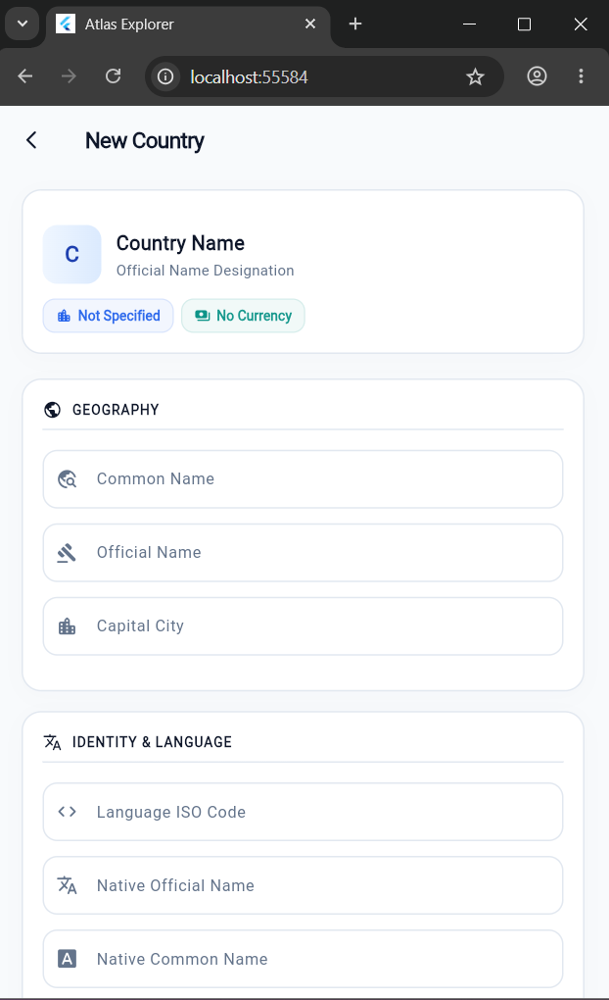
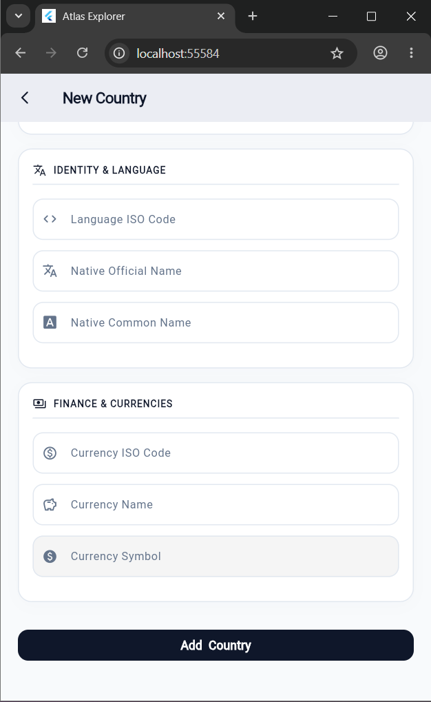
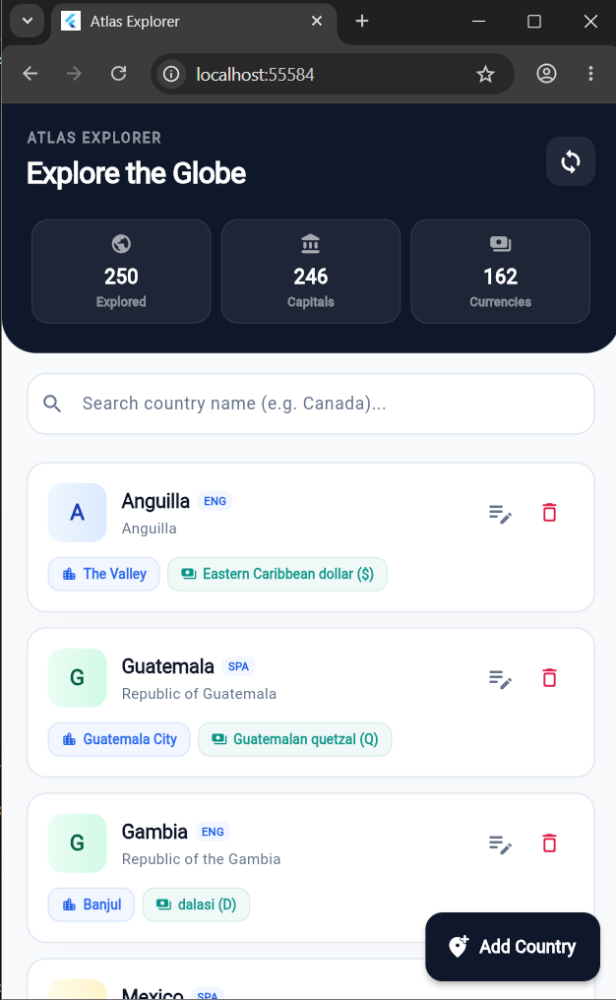
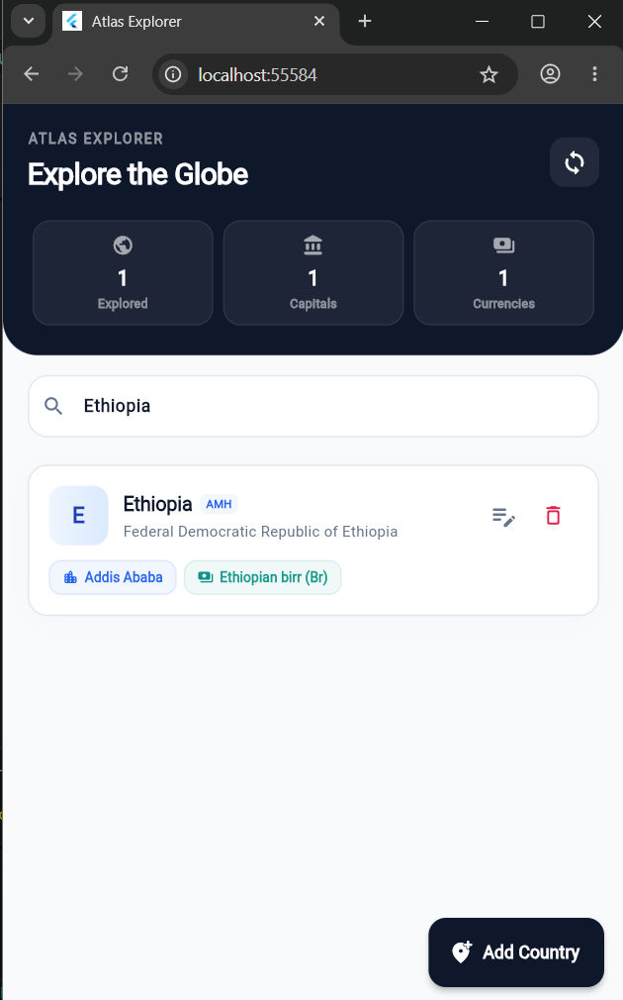
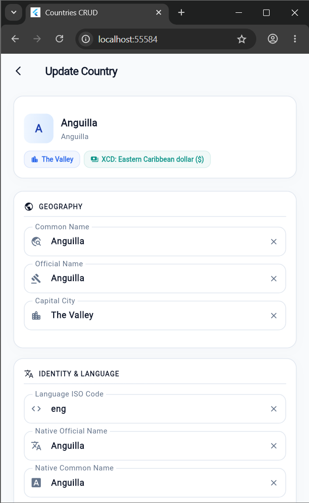
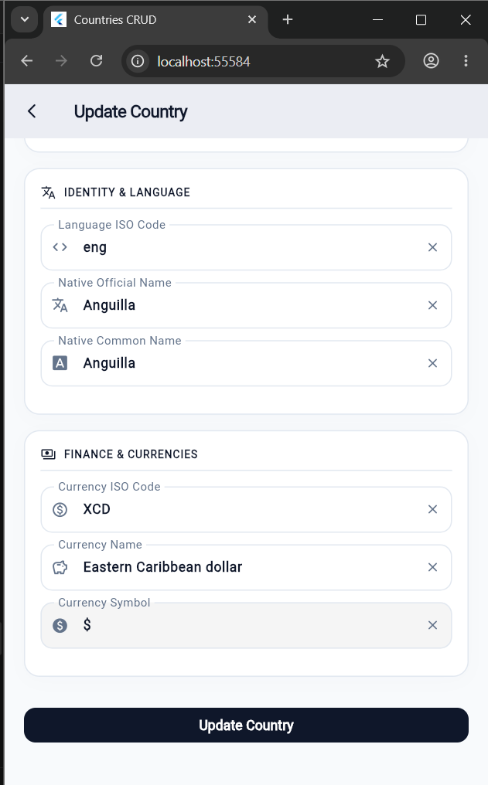
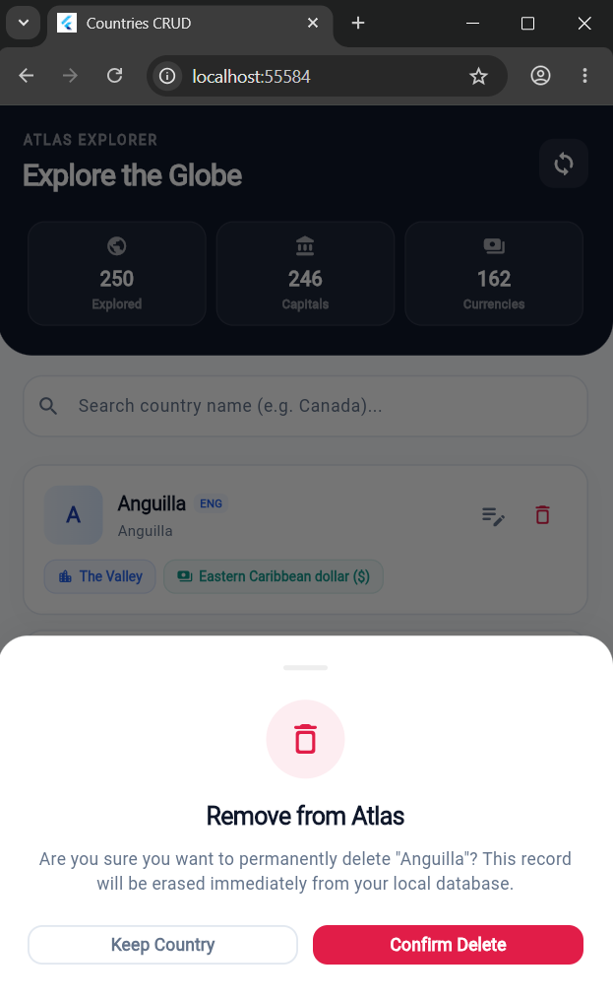
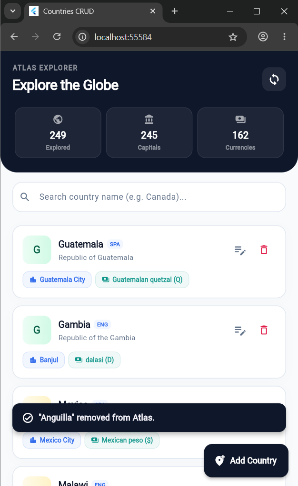

# Atlas Explorer

**Atlas Explorer** is a high-performance, premium Flutter application designed for exploring and registering countries globally. Powered by the **Dio HTTP Client** and structured with **BLoC State Management**, this app represents a state-of-the-art implementation of clean architecture, complete with a beautiful 

---

## Key Design & Architectural Highlights

- **Obsidian & Slate-Navy Color Palette**: Built on a solid Midnight Slate (`Color(0xFF0F172A)`) and Cobalt Blue (`Color(0xFF2563EB)`) brand theme, moving away from glowing AI-like gradients in favor of refined, flat, human-designed color schemes.
- **Notion/Slack-Style Initial Badges**: Automatically generates custom, soft-colored pastel avatar backgrounds with high-contrast text matching the country's starting letters.
- **Unified Single-Page Form Wizard**: Groups data input into elegant, outline-bordered geography, identity, and finance cards on a single exquisite scrolling page.
- **Instant Live Preview Card**: A real-time country card previewing your input *instantly as you type* sits right at the top of the form, showing exactly how the new record will look on the main dashboard.
- **Low-Profile Text Fields**: clicked/focused text fields render with a delicate, dim slate-grey border and normal weight (non-bold) floating labels for maximum visual harmony.
- **Robust BLoC & Dio Layer**: Reactive state transitions, comprehensive exception handling, dynamic search filters, pagination ("Load More" / "Show Less"), and optimistic UI updates.

---

## CRUD Operations & Live Application Screenshots

Here is a visual showcase of the core **CRUD** (Create, Read, Update, Delete) operations running in the Flutter Web environment:

### 1. Create Operation (C)
Allows users to discover and register new countries into the Atlas. It features an integrated **Live Preview Card** at the top that updates dynamically with every keystroke, a unified scrolling single-page layout, and a solid Midnight Slate publish button at the bottom.

#### Form View (Top & Live Card Preview)
<p align="center">
  
</p>

#### Form View (Bottom & Section Inputs)
<p align="center">
  
</p>

---

### 2. Read Operation (R)
Loads and lists all registered countries using optimistic caching, custom paginated blocks, and search filters.

#### Main Dashboard & Analytics Explored List
Includes a rich analytics header showing live counts of **Countries**, **Capitals**, and **Currencies** registered. Cards display custom pastel tags and Notion-style initial avatars.
<p align="center">
  
</p>

#### Filtering & Search Operations
Allows finding registered countries instantly using the capsule search panel with active filter states (e.g., search for "Ethiopia").
<p align="center">
  
</p>

---

### 3. Update Operation (U)
Allows modifying registered country records. Opening a country pre-fills all fields in the single-scroll wizard, featuring low-profile dim active borders and clean normal-weight floating labels.

#### Edit Country Form (Anguilla Pre-filled - Top)
<p align="center">
  
</p>

#### Edit Country Form (Scrolled to bottom - Finance & Currencies)
<p align="center">
  
</p>

---

### 4. Delete Operation (D)
Allows removing a country record instantly. It triggers a custom **Slide-Up Bottom Sheet** drawer instead of generic dialog popups, warning the user with a Crimson Red badge and flat confirm CTAs.

#### Slide-Up Warning Drawer Modal
<p align="center">
  
</p>

#### Successful Deletion Feedback Toast
<p align="center">
  
</p>

---

##  Quick Start & Installation

### Prerequisites
Make sure you have [Flutter SDK](https://flutter.dev/docs/get-started/install) installed on your machine.

### Setup Instructions
1. **Clone the repository:**
   ```bash
   git clone https://github.com/Efrata-Habte/CRUD-API-consumption-dio-.git
   ```

2. **Navigate to the Flutter project directory:**
   ```bash
   cd CRUD-API-consumption-dio-/crud_api_consumption_dio
   ```

3. **Install dependencies:**
   ```bash
   flutter pub get
   ```

4. **Run the application:**
   ```bash
   flutter run
   ```

---

## Tech Stack & Libraries
- **Language**: [Dart / Flutter](https://flutter.dev/)
- **State Management**: [flutter_bloc](https://pub.dev/packages/flutter_bloc) & [bloc](https://pub.dev/packages/bloc)
- **Networking**: [dio](https://pub.dev/packages/dio) (HTTP client with custom interceptors and exception wrappers)
- **Typography & Icons**: Material Icons & custom HSL/RGB colors
